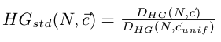
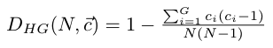
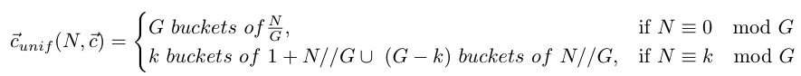
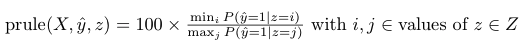
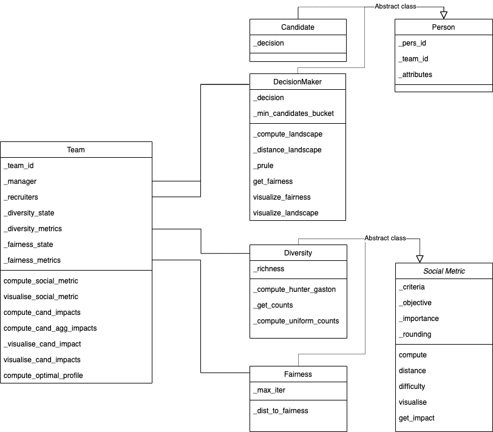

# FairSourcing

This project aims to evaluate the impact of a candidate on the decided socially aware metrics in the sourcing process.\
The system first evaluates the current situation of the team the candidate applies to.\
The impact is understood as the difference in the metrics if the candidate were hired.

The currently implemented metrics represent the fairness towards the candidates and the diversity of the team. The details about the metrics can be found below.\
We also provide visualisation of the decision makers landscape as well as scripts to generate data if you'd like to experiment.

*Context*\
We consider the different protected attributes to be independent, i.e. a person being Swiss does not impact their gender.\
We consider a simplified sourcing process:
1. The skill evaluation and team fit evaluation are outside of the scope of this project
2. We consider 2-steps : recruiter, deciding which of the candidates gets transferred to the line manager, and the manager, deciding which candidate they decide to hire.

## Features
- Model the demographic attributes of your company's teams
- Evaluate social metrics, such as diversity and fairness, across demographic attributes
- Summarize the current value of those metrics for your teams to support the establishment of a strategy
- Incorporate numerical objectives for the metrics and compute the actions needed to reach them as well as the effort
- Evaluate and display for each new individual decision the impact on the metrics
- Visualise the decision landscape of a decision maker

## Metrics
1. Diversity
  - Standardized Hunter Gaston: \
   \
 where we have N the total number of people in the team, G the number of categories for the diversity criteria and c the counts vector of the number of employees in each category (so sum(c)=N and len(c)=G), also
  \
 to compute the uniform counts distribution, we use the following logic : \
   with // the euclidian division.  
  - Distance: the number of employees to add in each category of the criteria to meet the objective value.
  - Impact: the number of increment divided by the change in value
  
2. Fairness
  - Prule:\
     \
    where we have Z the fairness dimension with i,j values of its categories and Z the decision (1 being the positive outcome).
  - Distance: the number of decisions to swap from one category to another of the criteria to meet the objective value.
  - Impact: the number of swaps divided by the change in value.

## Architecture
The structure of this repository is as follows:
- data folder --> contains necessary information about the company: the employees, the recruiters, the candidates and the objectives.
- data generation folder --> contains python scripts able to generate synthetic data, based on a params.yaml file, allowing you to define the different protected attributes, categories and probabilities to fit your simulation.
- images folder --> contains images visible in this readme
- metrics folder --> contains the python modules for each implemented metric
- candidate.py --> Candidate class, the target interaction with the team, Inherits the Person class
- decision_maker.py --> Decision Maker class (used both for manager and recruiter, differentiated with their type of decision), Inherits the Person class
- Demo.ipynb --> a Jupyter Notebook going through the different possibilities this project offers
- person.py --> a super class representing the concept of a person
- requirements.txt --> list of necessary libraries to run the project
- team.py --> Team class to link all the necessary information to evaluate a new Candidate

You can find below the diagram of the classes and dependencies: \


## Example
You can find a full process detailed in our Demo notebook. Where the project goes through all the features for the generated data.

## Installation
This project is compatible with Python 3.7+

#### Clone
Use the url : https://github.com/swisscom/ai-research-fairsourcing 

#### Dependencies
Install the necessary libraries with the following command:
```
pip install -r requirements.txt
```

#### Generate Data
We provide scripts to generate synthetic data and let you explore with your desired parameters.
To generate:
```
python generate_fake_team.py params.yaml ../data/
python generate_fake_team_objectives.py params.yaml ../data/
python generate_fake_candidates.py params.yaml ../data/
python generate_fake_recruiters.py params.yaml ../data/
```

## Team
Emma Lejal Glaude (@emlg) and Claudiu Musat (@claudiumusat)
